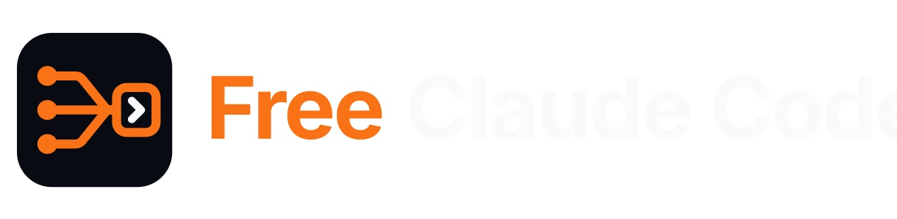
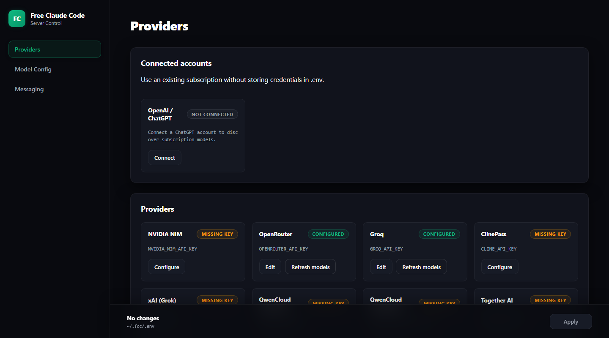

<div align="center">

<h1>
  <picture>
    <source media="(prefers-color-scheme: light)" srcset="assets/free-claude-code-wordmark-light.svg">
    
  </picture>
</h1>

[](https://opensource.org/licenses/MIT)
[](https://www.python.org/downloads/)
[](https://github.com/astral-sh/uv)
[](https://github.com/Alishahryar1/free-claude-code/actions/workflows/tests.yml)
[](https://pypi.org/project/ty/)
[](https://github.com/astral-sh/ruff)
[](https://github.com/Delgan/loguru)

[Quick Start](#quick-start) · [Providers](#choose-a-provider) · [Clients](#connect-your-client) · [Integrations](#optional-integrations) · [Manage](#manage-your-installation)

</div>

<p align="center">
  <em>Independent open-source project. Not affiliated with or endorsed by Anthropic. Claude and Claude Code are trademarks of Anthropic.</em>
</p>

## What You Get

- **49 ToS-friendly providers. 1.3B+ free tokens every month.** Use free, paid, subscription, and local models from one searchable UI without putting your account at risk. FCC follows provider terms and removes integrations if they stop being allowed.
- **10 coding agents. One model catalog.** Run [Claude Code](https://code.claude.com/docs/en/overview), [Codex](https://github.com/openai/codex), [Pi](https://github.com/earendil-works/pi), [OpenCode](https://github.com/anomalyco/opencode), [Cline](https://github.com/cline/cline), [Hermes](https://github.com/NousResearch/hermes-agent), [DeepSeek Harness](https://github.com/deepseek-ai/deepseek-harness), [Grok Build](https://github.com/xai-org/grok-build), [Muse Code](https://research.meta.ai/blog/introducing-muse-code-and-muse-spark-1-2/), or [Aider](https://aider.chat/) with your FCC models.
- **Keep coding through provider outages.** After retries are exhausted, FCC automatically tries your next configured model without making you restart the turn—across every client.
- **Up to 90% fewer terminal-output tokens.** Optional [RTK](https://github.com/rtk-ai/rtk) filters common command output, while five FCC optimizations handle quota probes, command-prefix detection, titles, suggestions, and filepaths without calling a provider.
- **Terminal, desktop, IDE, or phone.** Work through native launchers, [VS Code](https://code.visualstudio.com/), [Codex App](https://learn.chatgpt.com/docs/app), [JetBrains](https://www.jetbrains.com/), [Discord](https://discord.com/), or [Telegram](https://telegram.org/).
- **Private local chat.** Use Chat Sessions in Admin to talk with any configured FCC model, with persisted history, thinking controls, streaming, fallback, and compaction.
- **Voice notes in. Code out.** Talk to your agent using local [Whisper](https://github.com/openai/whisper) or [NVIDIA NIM](https://docs.nvidia.com/nim/speech/latest/asr/deploy-asr-models/whisper.html) transcription.
- **Agent capabilities stay intact.** Stream responses, use tools, preserve native interleaved thinking for maximum performance, send images, and route [Fable](https://www.anthropic.com/claude/fable), [Opus](https://www.anthropic.com/claude/opus), [Sonnet](https://www.anthropic.com/claude/sonnet), and [Haiku](https://www.anthropic.com/claude/haiku) independently with compatible models.

Free-tier availability and limits are controlled by each provider and may change.

<div align="center">
  
  <p><em>Claude Code running with FCC.</em></p>
</div>

## Quick Start

<a id="install"></a>

### 1. Install Or Update

macOS/Linux:

```bash
curl -fsSL "https://raw.githubusercontent.com/Alishahryar1/free-claude-code/main/scripts/install.sh" | sh
```

Windows PowerShell:

```powershell
& ([scriptblock]::Create((irm "https://raw.githubusercontent.com/Alishahryar1/free-claude-code/main/scripts/install.ps1")))
```

Re-run the same command to update. When prompted, choose at least one coding agent and optionally RTK. You can review the installers before running them: [install.sh](scripts/install.sh) and [install.ps1](scripts/install.ps1).

### 2. Start FCC

#### Windows

Open **Free Claude Code** from your desktop or Start menu.

#### macOS

Open **Free Claude Code** from your desktop or Applications folder.

#### Linux

Run:

```bash
fcc-server
```

FCC opens the Admin UI after starting. On Windows and macOS, use the tray or
menu-bar icon to open Admin, restart, or quit. When using `fcc-server`, keep its
terminal open.

<a id="nvidia-nim-provider"></a>

### 3. Configure NVIDIA NIM

1. Create an API key at [build.nvidia.com/settings/api-keys](https://build.nvidia.com/settings/api-keys).
2. Open the Admin UI URL from the server log.
3. Paste the key into `NVIDIA_NIM_API_KEY`.
4. Leave `MODEL` on the default `nvidia_nim/nvidia/nemotron-3-super-120b-a12b`, or search the model dropdown and select another model.
5. Click **Apply**.

To protect the local proxy with a bearer token, enable **Proxy Authentication**
in Admin.

<div align="center">
  
</div>

### 4. Run Your Coding Agent

Claude Code:

```bash
fcc-claude
```

Codex:

```bash
fcc-codex
```

Pi:

```bash
fcc-pi
```

OpenCode:

```bash
fcc-opencode
```

Cline:

```bash
fcc-cline
```

Hermes:

```bash
fcc-hermes
```

DeepSeek Harness Web:

```bash
fcc-dsh
```

Grok Build:

```bash
fcc-grok
```

Muse Code:

```bash
fcc-muse
```

Aider:

```bash
fcc-aider
```

<a id="model-picker"></a>

<div align="center">
  
  <p><em>Select an FCC model from Claude Code's native <code>/model</code> picker.</em></p>
</div>

## Choose A Provider

1. Open a provider link below for its key, models, or setup instructions.
2. In the Admin UI, configure the listed setting. For OpenAI, use
   **Providers → Connected accounts** instead.
3. Search the `MODEL` dropdown and select a model. If the provider cannot list
   models, enter `<provider-id>/<exact-provider-model-id>` manually.
4. Click **Apply**.

Optional: add an ordered **Fallback Models** list under **Model Config**. It
applies to every connected client. A failed request may reach and consume usage
from more than one provider before succeeding.

<details>
<summary><strong>Provider catalog</strong></summary>

[GitHub Models retired on July 30, 2026](https://github.blog/changelog/2026-07-30-github-models-is-now-retired/). FCC automatically resets retired model
selections to your configured default, or the built-in default when `MODEL` itself
is retired. Configure that default provider in Admin if its credentials are missing.
GitHub Copilot is a separate service and is not a replacement provider in FCC.

| Provider | Admin UI setting | Example `MODEL` |
| --- | --- | --- |
| [NVIDIA NIM](https://build.nvidia.com/settings/api-keys) | `NVIDIA_NIM_API_KEY` | `nvidia_nim/nvidia/nemotron-3-super-120b-a12b` |
| [OpenRouter](https://openrouter.ai/keys) | `OPENROUTER_API_KEY` | `open_router/openrouter/free` |
| [Groq](https://console.groq.com/keys) | `GROQ_API_KEY` | `groq/llama-3.3-70b-versatile` |
| [ClinePass](https://docs.cline.bot/getting-started/clinepass) | `CLINE_API_KEY` | `cline_pass/cline-pass/kimi-k3` |
| [OpenAI / ChatGPT](https://learn.chatgpt.com/docs/auth) | Connect ChatGPT in the Admin UI | `openai/<model-id>` |
| [xAI (Grok)](https://console.x.ai/team/default/api-keys) | `XAI_API_KEY` | `xai/grok-4.5` |
| [QwenCloud Token Plan](https://home.qwencloud.com/api-keys) | `QWENCLOUD_API_KEY` | `qwencloud/qwen3.7-plus` |
| [QwenCloud Coding Plan](https://home.qwencloud.com/api-keys) | `QWENCLOUD_CODING_API_KEY` | `qwencloud_coding/qwen3.7-plus` |
| [Together AI](https://api.together.ai/settings/api-keys) | `TOGETHER_API_KEY` | `together/zai-org/GLM-5.2` |
| [DeepInfra](https://deepinfra.com/dash/api_keys) | `DEEPINFRA_API_KEY` | `deepinfra/deepseek-ai/DeepSeek-V4-Flash` |
| [SiliconFlow](https://cloud.siliconflow.com/account/ak) | `SILICONFLOW_API_KEY` | `siliconflow/Qwen/Qwen3-32B` |
| [Nebius Token Factory](https://tokenfactory.nebius.com/project/api-keys) | `NEBIUS_API_KEY` | `nebius/Qwen/Qwen3-30B-A3B` |
| [Chutes](https://chutes.ai/docs/getting-started/authentication) | `CHUTES_API_KEY` | `chutes/Qwen/Qwen3-32B-TEE` |
| [Featherless AI](https://featherless.ai/account/api-keys) | `FEATHERLESS_API_KEY` | `featherless/Qwen/Qwen3-32B` |
| [Agnes AI](https://agnes-ai.com/) | `AGNES_API_KEY` | `agnes/agnes-2.0-flash` |
| [ZenMux](https://zenmux.ai/platform/pay-as-you-go) | `ZENMUX_API_KEY` | `zenmux/deepseek/deepseek-v4-flash-free` |
| [W&B Inference](https://wandb.ai/settings) | `WANDB_API_KEY` | `wandb/openai/gpt-oss-20b` |
| [Azure OpenAI](https://learn.microsoft.com/azure/foundry/openai/how-to/chatgpt) | `AZURE_OPENAI_API_KEY` and `AZURE_OPENAI_BASE_URL` | `azure_openai/<deployment-name>` |
| [Google AI Studio (Gemini)](https://aistudio.google.com/apikey) | `GEMINI_API_KEY` | `gemini/models/gemini-3.1-flash-lite` |
| [Google Vertex AI](https://cloud.google.com/vertex-ai/generative-ai/docs/start/openai) | `VERTEX_PROJECT_ID` + ADC | `vertex/google/gemini-3.5-flash` |
| [DeepSeek](https://platform.deepseek.com/api_keys) | `DEEPSEEK_API_KEY` | `deepseek/deepseek-chat` |
| [Mistral La Plateforme](https://console.mistral.ai/) | `MISTRAL_API_KEY` | `mistral/devstral-small-latest` |
| [Mistral Codestral](https://console.mistral.ai/) | `CODESTRAL_API_KEY` | `mistral_codestral/codestral-latest` |
| [OpenCode Zen](https://opencode.ai/auth) | `OPENCODE_API_KEY` | `opencode_zen/gpt-5.3-codex` |
| [OpenCode Go](https://opencode.ai/auth) | `OPENCODE_API_KEY` | `opencode_go/minimax-m2.7` |
| [Vercel AI Gateway](https://vercel.com/docs/ai-gateway/models-and-providers) | `AI_GATEWAY_API_KEY` | `vercel/openai/gpt-5.5` |
| [Amazon Bedrock](https://console.aws.amazon.com/bedrock/) | `AWS_BEARER_TOKEN_BEDROCK` | `bedrock/openai.gpt-oss-120b` |
| [Hugging Face Inference Providers](https://huggingface.co/settings/tokens) | `HUGGINGFACE_API_KEY` | `huggingface/Qwen/Qwen3-Coder-480B-A35B-Instruct:fastest` |
| [Cohere](https://dashboard.cohere.com/api-keys) | `COHERE_API_KEY` | `cohere/command-a-plus-05-2026` |
| [Wafer](https://wafer.ai/) | `WAFER_API_KEY` | `wafer/DeepSeek-V4-Pro` |
| [Kimi API](https://platform.moonshot.ai/console/api-keys) | `KIMI_API_KEY` | `kimi/kimi-k2.5` |
| [Kimi Code](https://www.kimi.com/code/console) | `KIMI_CODE_API_KEY` | `kimi_code/k3` |
| [MiniMax](https://platform.minimax.io/user-center/basic-information/interface-key) | `MINIMAX_API_KEY` | `minimax/MiniMax-M3` |
| [Cerebras Inference](https://cloud.cerebras.ai/) | `CEREBRAS_API_KEY` | `cerebras/gpt-oss-120b` |
| [SambaNova](https://cloud.sambanova.ai/apis) | `SAMBANOVA_API_KEY` | `sambanova/Meta-Llama-3.3-70B-Instruct` |
| [Kilo.ai](https://kilo.ai) | `KILO_API_KEY` | `kilo/kilo-auto/free` |
| [Fireworks AI](https://fireworks.ai/account/api-keys) | `FIREWORKS_API_KEY` | `fireworks/accounts/fireworks/models/llama-v3p3-70b-instruct` |
| [Novita AI](https://novita.ai/settings/key-management) | `NOVITA_API_KEY` | `novita/deepseek/deepseek-v4-flash-0731` |
| [Cloudflare Workers AI](https://developers.cloudflare.com/workers-ai/) | `CLOUDFLARE_API_TOKEN` and `CLOUDFLARE_ACCOUNT_ID` | `cloudflare/@cf/moonshotai/kimi-k2.6` |
| [Z.ai Coding Plan](https://z.ai/manage-apikey/apikey-list) | `ZAI_API_KEY` | `zai/glm-5.2` |
| [Z.ai API (pay as you go)](https://z.ai/manage-apikey/apikey-list) | `ZAI_API_KEY` | `zai_api/glm-4.7-flash` |
| [TokenRouter](https://www.tokenrouter.com/) | `TOKENROUTER_API_KEY` | `tokenrouter/moonshotai/kimi-k3-free` |
| [NaraRoute](https://router.bynara.id/) | `NARAROUTE_API_KEY` | `nararoute/kimi-k3-free` |
| [Poolside AI](https://platform.poolside.ai/) | `POOLSIDE_API_KEY` | `poolside/poolside/laguna-s-2.1` |
| [LLM7.io](https://dash.llm7.io/) | `LLM7_API_KEY` | `llm7/default` |
| [Ollama Cloud](https://ollama.com/settings/keys) | `OLLAMA_API_KEY` | `ollama_cloud/qwen3-coder:480b` |
| [LM Studio](https://lmstudio.ai/) | `LM_STUDIO_BASE_URL` | `lmstudio/<model-id>` |
| [llama.cpp](https://github.com/ggml-org/llama.cpp) | `LLAMACPP_BASE_URL` | `llamacpp/<model-id>` |
| [Ollama](https://ollama.com/) | `OLLAMA_BASE_URL` | `ollama/<model-tag>` |

</details>

<details>
<summary><strong>Provider-specific setup</strong></summary>

- OpenAI uses your ChatGPT subscription rather than an API key. Connect from
  **Providers → Connected accounts** in the Admin UI. Use device code on
  headless systems. Restart an already-running agent after connecting.
- Azure OpenAI uses the deployment names from your resource. Set
  `AZURE_OPENAI_BASE_URL` to its complete v1 endpoint, such as
  `https://YOUR-RESOURCE-NAME.openai.azure.com/openai/v1/`, and select a
  deployment that supports Chat Completions. Enter the deployment name as a
  custom model slug if it does not appear in the model dropdown.
- Mistral Codestral uses a separate key from Mistral La Plateforme.
- Kimi Code subscription keys use `kimi_code/`; Kimi API credit keys use
  `kimi/`. Kimi Code plans are for personal interactive coding-agent use under
  [Kimi's community guidelines](https://www.kimi.com/code/docs/en/kimi-code/community-guidelines.html).
- QwenCloud Coding Plan keys use `qwencloud_coding/`; QwenCloud Token Plan keys
  use `qwencloud/`. The keys and endpoints are not interchangeable. Coding Plan
  is for local, personal, interactive coding-agent use under the
  [Coding Plan terms](https://www.alibabacloud.com/help/en/model-studio/coding-plan).
- OpenCode Zen and OpenCode Go share `OPENCODE_API_KEY` but use the explicit
  `opencode_zen/` and `opencode_go/` model prefixes.
- For Amazon Bedrock, set `BEDROCK_BASE_URL` to the URL for the same region as
  the API key and select one of the listed models.
- Vertex AI uses Google Application Default Credentials instead of an API key.
  Locally, run `gcloud auth application-default login` once; service-account
  files and attached service accounts also work. Set `VERTEX_PROJECT_ID`, and
  optionally change `VERTEX_LOCATION` from its `global` default.
- Cloudflare requires both its API token and account ID.
- For Ollama Cloud, use the exact model IDs shown in the model picker. Local
  Ollama uses the separate `ollama/` prefix.
- Prefer tool-capable models for coding agents. Local models also need enough context for the agent's system prompt and tool definitions.

</details>

<details>
<summary><strong>Local provider setup</strong></summary>

### LM Studio

Start LM Studio's local server, load a tool-capable model, and use the model identifier shown by LM Studio with the `lmstudio/` prefix. The default URL is `http://localhost:1234/v1`.

### llama.cpp

Start `llama-server` with its OpenAI-compatible Chat Completions API and enough context for the model. Use the local model ID with the `llamacpp/` prefix. `LLAMACPP_BASE_URL` defaults to `http://localhost:8080/v1`; FCC accepts either the server root or an explicit `/v1` suffix.

### Ollama

```bash
ollama pull llama3.1
ollama serve
```

Use the tag shown by `ollama list` with the `ollama/` prefix. `OLLAMA_BASE_URL` defaults to `http://localhost:11434`; FCC accepts either the root URL or an explicit `/v1` suffix.

</details>

<details>
<summary><strong>Optional model-tier routing</strong></summary>

`MODEL` is the fallback for every request. Select a model for `MODEL_FABLE`, `MODEL_OPUS`, `MODEL_SONNET`, or `MODEL_HAIKU` to override an individual Claude Code tier; select **None** to use `MODEL`.

For example, route Opus to `nvidia_nim/nvidia/nemotron-3-super-120b-a12b`, Sonnet to `open_router/openrouter/free`, Haiku to `lmstudio/qwen3.5-coder`, and keep `MODEL` on `zai/glm-5.2`.

</details>

<details>
<summary><strong>Reasoning control</strong></summary>

Open **Admin UI → Model Config → Reasoning** and select the behavior you want.

| Selection | Behavior |
| --- | --- |
| **From client** (default) | Use the effort sent by Claude Code, Codex, Pi, OpenCode, Cline, Hermes, DeepSeek Harness, Grok Build, Muse Code, or Aider. If none is sent, keep the provider default. |
| **Off** | Request reasoning to be disabled. |
| **Low**, **Medium**, **High**, **X-High**, or **Max** | Override the client with the selected reasoning level. |
| **Inherit** (Fable, Opus, Sonnet, and Haiku only) | Use the root Reasoning selection. |

Providers that do not support a selected control retain their own behavior.

</details>

<a id="connect-your-client"></a>

## Connect Your Client

For terminal use, start `fcc-server`, then run `fcc-claude`, `fcc-codex`,
`fcc-pi`, `fcc-opencode`, `fcc-cline`, `fcc-hermes`, `fcc-dsh`, `fcc-grok`,
`fcc-muse`, or `fcc-aider`.
Use the guides below for editor integrations.

<details>
<summary><strong>Claude Code in VS Code</strong></summary>

Install the [Claude Code extension](https://marketplace.visualstudio.com/items?itemName=anthropic.claude-code). Open VS Code's user settings as JSON and add:

```json
"claudeCode.disableLoginPrompt": true,
"claudeCode.environmentVariables": [
  { "name": "ANTHROPIC_BASE_URL", "value": "http://localhost:8082" },
  { "name": "ANTHROPIC_AUTH_TOKEN", "value": "freecc" },
  { "name": "CLAUDE_CODE_ENABLE_GATEWAY_MODEL_DISCOVERY", "value": "1" },
  { "name": "CLAUDE_CODE_AUTO_COMPACT_WINDOW", "value": "190000" },
  { "name": "DISABLE_AUTOUPDATER", "value": "1" },
  { "name": "DISABLE_FEEDBACK_COMMAND", "value": "1" },
  { "name": "DISABLE_ERROR_REPORTING", "value": "1" }
]
```

Match the port and authentication token to the Admin UI, then reload the extension.

</details>

<details>
<summary><strong>Codex App</strong></summary>

Start FCC, then edit your Codex configuration:

- Windows: `%USERPROFILE%\.codex\config.toml`
- macOS: `~/.codex/config.toml`

Add the matching model-catalog path and replace `YOUR_USERNAME`.

Windows:

```toml
model_catalog_json = "C:/Users/YOUR_USERNAME/.fcc/codex-model-catalog.json"
```

macOS:

```toml
model_catalog_json = "/Users/YOUR_USERNAME/.fcc/codex-model-catalog.json"
```

Then add the shared FCC settings:

```toml
model_provider = "fcc"
model = "nvidia_nim/nvidia/nemotron-3-super-120b-a12b"

[model_providers.fcc]
name = "Free Claude Code"
base_url = "http://127.0.0.1:8082/v1"
wire_api = "responses"

[model_providers.fcc.auth]
command = "fcc-codex"
args = ["--print-proxy-auth-token"]
```

Match the model and port to the Admin UI. The auth command reads FCC's current
proxy token automatically. Restart the Codex App after setup or model changes,
then select an FCC model from its model picker.

</details>

<details>
<summary><strong>Codex in VS Code</strong></summary>

Install the [Codex extension](https://marketplace.visualstudio.com/items?itemName=openai.chatgpt). Create or edit `~/.codex/config.toml` (`%USERPROFILE%\.codex\config.toml` on Windows):

```toml
model_provider = "fcc"
model = "nvidia_nim/nvidia/nemotron-3-super-120b-a12b"

[model_providers.fcc]
name = "Free Claude Code"
base_url = "http://127.0.0.1:8082/v1"
wire_api = "responses"

[model_providers.fcc.auth]
command = "fcc-codex"
args = ["--print-proxy-auth-token"]
```

Match `model` and the port to the Admin UI. The auth command reads FCC's current
proxy token automatically. Restart VS Code after setup or model changes. For
WSL-backed Codex, edit the file inside WSL.

</details>

<details>
<summary><strong>Claude Code in JetBrains ACP</strong></summary>

Edit the installed Claude ACP configuration:

- Windows: `C:\Users\%USERNAME%\AppData\Roaming\JetBrains\acp-agents\installed.json`
- Linux/macOS: `~/.jetbrains/acp.json`

Set the environment for `acp.registry.claude-acp`:

```json
"env": {
  "ANTHROPIC_BASE_URL": "http://localhost:8082",
  "ANTHROPIC_AUTH_TOKEN": "freecc",
  "CLAUDE_CODE_ENABLE_GATEWAY_MODEL_DISCOVERY": "1",
  "CLAUDE_CODE_AUTO_COMPACT_WINDOW": "190000",
  "DISABLE_AUTOUPDATER": "1",
  "DISABLE_FEEDBACK_COMMAND": "1",
  "DISABLE_ERROR_REPORTING": "1"
}
```

Match the port and token to the Admin UI, then restart the IDE.

</details>

<details>
<summary><strong>Claude Code still asks you to log in</strong></summary>

If Claude Code asks you to log in after you configure the FCC URL and token, open its state file:

- Windows: `%USERPROFILE%\.claude.json`
- macOS/Linux/WSL: `~/.claude.json`

Merge this property into the existing JSON without removing its other fields:

```json
"hasCompletedOnboarding": true
```

If the file does not exist, create it with a complete JSON object:

```json
{
  "hasCompletedOnboarding": true
}
```

Restart Claude Code or the IDE after saving the file.

</details>

<a id="optional-integrations"></a>

## Optional Integrations

Configure integrations from **Admin UI → Messaging**, then click **Apply**.

<details>
<summary><strong>Discord bot</strong></summary>

1. Create a bot in the [Discord Developer Portal](https://discord.com/developers/applications).
2. Enable **Message Content Intent** and invite it with read, send,
   message-history, and **Manage Messages** permissions so `/clear` can remove
   user prompts.
3. Set **Messaging Platform** to **discord**.
4. Enter **Discord Bot Token**, **Allowed Discord Channels**, and an absolute **Allowed Directory**.
5. Apply the settings and restart the server if requested.

</details>

<details>
<summary><strong>Telegram bot</strong></summary>

1. Create a bot with [@BotFather](https://t.me/BotFather).
2. Get your numeric user ID from [@userinfobot](https://t.me/userinfobot).
   In groups, grant the bot permission to delete messages.
3. Set **Messaging Platform** to **telegram**.
4. Enter **Telegram Bot Token**, **Allowed Telegram User ID**, and an absolute **Allowed Directory**.
5. Apply the settings and restart the server if requested.

</details>

### Messaging commands

| Usage | Behavior |
| --- | --- |
| `/stats` | Show session state. |
| Standalone `/stop` | Cancel all work. |
| Reply with `/stop` | Cancel only the selected request while other queued requests continue. |
| Standalone `/clear` | Reset all FCC state and remove every tracked message in that chat, including user prompts, voice notes, FCC replies, Telegram's online notice, and the clear command itself. |
| Reply with `/clear` | Delete the selected message and its literal platform reply subtree while preserving its ancestors and siblings. |

<details>
<summary><strong>Voice notes</strong></summary>

Re-run the installer with the command for your voice backend.

macOS/Linux:

NVIDIA NIM transcription:

```bash
curl -fsSL "https://raw.githubusercontent.com/Alishahryar1/free-claude-code/main/scripts/install.sh" | sh -s -- --voice-nim
```

Local Whisper on CPU or CUDA:

```bash
curl -fsSL "https://raw.githubusercontent.com/Alishahryar1/free-claude-code/main/scripts/install.sh" | sh -s -- --voice-local
```

Both backends:

```bash
curl -fsSL "https://raw.githubusercontent.com/Alishahryar1/free-claude-code/main/scripts/install.sh" | sh -s -- --voice-all
```

Local Whisper with CUDA 13.0:

```bash
curl -fsSL "https://raw.githubusercontent.com/Alishahryar1/free-claude-code/main/scripts/install.sh" | sh -s -- --voice-local --torch-backend cu130
```

Windows PowerShell:

NVIDIA NIM transcription:

```powershell
& ([scriptblock]::Create((irm "https://raw.githubusercontent.com/Alishahryar1/free-claude-code/main/scripts/install.ps1"))) -VoiceNim
```

Local Whisper on CPU or CUDA:

```powershell
& ([scriptblock]::Create((irm "https://raw.githubusercontent.com/Alishahryar1/free-claude-code/main/scripts/install.ps1"))) -VoiceLocal
```

Both backends:

```powershell
& ([scriptblock]::Create((irm "https://raw.githubusercontent.com/Alishahryar1/free-claude-code/main/scripts/install.ps1"))) -VoiceAll
```

Local Whisper with CUDA 13.0:

```powershell
& ([scriptblock]::Create((irm "https://raw.githubusercontent.com/Alishahryar1/free-claude-code/main/scripts/install.ps1"))) -VoiceLocal -TorchBackend cu130
```

Restart `fcc-server`. In **Admin UI → Messaging → Voice**, enable voice notes, select `cpu`, `cuda`, or `nvidia_nim`, and choose the Whisper model. Local gated models need `HUGGINGFACE_API_KEY`; NVIDIA NIM transcription needs `NVIDIA_NIM_API_KEY`.

</details>

## Manage Your Installation

Run `fcc-server --version` to check the installed version without starting FCC.

### Update

Re-run the matching command from [Install Or Update](#install).

### Muse Code on native Windows

Rerunning FCC's Windows installer with Muse Code selected installs or updates FCC's managed Muse executable. To install or update only Muse Code:

```powershell
& ([scriptblock]::Create((irm "https://raw.githubusercontent.com/Alishahryar1/free-claude-code/main/scripts/install-muse.ps1")))
```

To remove only that managed Muse executable while preserving Muse data and other installations:

```powershell
& ([scriptblock]::Create((irm "https://raw.githubusercontent.com/Alishahryar1/free-claude-code/main/scripts/uninstall-muse.ps1")))
```

FCC's ordinary uninstaller below continues to leave Muse Code installed.

### Uninstall

Stop every running FCC command before uninstalling.

**Removes**

- Free Claude Code, including its desktop launcher and commands
- `~/.fcc/`

**Keeps**

- uv and Python
- Claude Code, Codex, Pi, OpenCode, Cline, Hermes, DeepSeek Harness, Grok Build, Muse Code, Aider, and RTK
- Shared PATH entries

macOS/Linux:

```bash
curl -fsSL "https://raw.githubusercontent.com/Alishahryar1/free-claude-code/main/scripts/uninstall.sh" | sh
```

Windows PowerShell:

```powershell
& ([scriptblock]::Create((irm "https://raw.githubusercontent.com/Alishahryar1/free-claude-code/main/scripts/uninstall.ps1")))
```

## Project Links

- [Report bugs or request features](https://github.com/Alishahryar1/free-claude-code/issues)
- [Architecture and extension guide](ARCHITECTURE.md)
- [Contributing guide](CONTRIBUTING.md)

## License

MIT License. See [LICENSE](LICENSE) for details.


## 🌐 Web Resources & Interactive Index
- [CATCH THIEF](https://studyquests.github.io/catch-thief.html)
- [LABUBU DOLL MUKBANG ASMR UNBLOCKED](https://studyplaying.github.io/labubu-doll-mukbang-asmr-unblocked.html)
- [CATEGORY MANAGEMENT209](https://studyquests.pages.dev/category-management209.html)
- [CATEGORY TETRIS](https://studyplaying.github.io/category-tetris.html)
- [SLINKY COLOR SORT](https://learnquester.github.io/slinky-color-sort.html)
- [DRIVE TO SURVIVE](https://studyquests.pages.dev/drive-to-survive.html)
- [CATEGORY CASUAL 9](https://quizverses.github.io/category-casual-9.html)
- [INDEX33](https://studyplaying.github.io/index33.html)
- [SLOPE SPOOKY](https://studyplaying.github.io/slope-spooky.html)
- [FRUIT CATCHER](https://studyquests.github.io/fruit-catcher.html)
- [MOTORCYCLE RACER ROAD MAYHEM](https://quizverses.pages.dev/motorcycle-racer-road-mayhem.html)
- [TWO STUNT SUPERCARS](https://studyquesthub.web.app/two-stunt-supercars.html)
- [FOXY ECO SORT](https://studyquesthub.web.app/foxy-eco-sort.html)
- [DROP ANIMALS](https://studyquests.github.io/drop-animals.html)
- [CATEGORY MAGIC46](https://quizverses.pages.dev/category-magic46.html)
- [LORENZO THE RUNNER](https://quizverses.pages.dev/lorenzo-the-runner.html)
- [CUBEREALM IO](https://studyquesthub.web.app/cuberealm-io.html)
- [CATEGORY MONSTER206](https://studyquests.pages.dev/category-monster206.html)
- [CATEGORY EDUCATIONAL](https://quizverses.pages.dev/category-educational.html)
- [U SHAPE PUZZLE](https://quizverses.github.io/u-shape-puzzle.html)
- [STREET TRAFFIC RACER](https://studyquests.github.io/street-traffic-racer.html)
- [CLONEUP STACK YOURSELF](https://studyplaying.github.io/cloneup-stack-yourself.html)
- [CAPYBARA JUMP](https://studyquests.pages.dev/capybara-jump.html)
- [THE COUNTERFEIT BANK](https://studyquests.pages.dev/the-counterfeit-bank.html)
- [GRILL IT ALL](https://studyquests.pages.dev/grill-it-all.html)
- [CATEGORY DRESS UP](https://quizverses.pages.dev/category-dress-up.html)
- [WACKY STRIKE](https://studyplaying.github.io/wacky-strike.html)
- [CATEGORY PLATFORM260](https://studyquests.pages.dev/category-platform260.html)
- [MOON LEAGUE SPORTS SEASON](https://studyplaying.github.io/moon-league-sports-season.html)
- [ROPEWAY MASTER](https://quizverses-9d2f2.web.app/ropeway-master.html)
- [THROUGH THE WALL 3D](https://quizverses-9d2f2.web.app/through-the-wall-3d.html)
- [CATEGORY OBSTACLE299](https://studyquests.pages.dev/category-obstacle299.html)
- [CATEGORY STRATEGY](https://studyquests.pages.dev/category-strategy.html)
- [SNIPER MASTER](https://studyplaying.github.io/sniper-master.html)
- [MAGIC BUBBLES](https://studyplaying.github.io/magic-bubbles.html)
- [CATEGORY FPS 2](https://quizverses.pages.dev/category-fps-2.html)
- [CATEGORY CARTOON76](https://studyquests.pages.dev/category-cartoon76.html)
- [WAVE DASH GEOMETRY ARROW](https://studyquesthub.web.app/wave-dash-geometry-arrow.html)
- [MEGA JUMP](https://quizverses.github.io/mega-jump.html)
- [JOURNEY OF ESCAPE](https://studyquests.github.io/journey-of-escape.html)
- [CATEGORY CONTROLLER59](https://studyquests.pages.dev/category-controller59.html)
- [STACKTRIS 2048](https://quizverses.pages.dev/stacktris-2048.html)
- [INDEX20](https://studyquesthub.web.app/index20.html)
- [FLOOF MY PET HOUSE](https://studyquests.github.io/floof-my-pet-house.html)
- [LUCY ALL SEASON FASHIONINSTA](https://studyplaying.github.io/lucy-all-season-fashioninsta.html)
- [SMARTLE](https://quizverses.github.io/smartle.html)
- [DUSTY MAZE HUNTER](https://studyquesthub.web.app/dusty-maze-hunter.html)
- [DEAD PARADISE](https://studyquests.pages.dev/dead-paradise.html)
- [CRAZY BUNNIES](https://quizverses.github.io/crazy-bunnies.html)
- [HIDDEN OBJECT TIME TRAVEL](https://quizverses.github.io/hidden-object-time-travel.html)
- [IDLE BARBER SHOP](https://quizverses.pages.dev/idle-barber-shop.html)
- [PET CONNECT MATCH](https://studyplaying.github.io/pet-connect-match.html)
- [PATH ICE](https://studyquesthub.web.app/path-ice.html)
- [BASKET SWAP](https://quizverses.github.io/basket-swap.html)
- [FASHIONISTA CHRISTMAS EVE PARTY](https://quizverses.pages.dev/fashionista-christmas-eve-party.html)
- [LABUBA HALLOWEEN INFESTATION](https://studyplaying.github.io/labuba-halloween-infestation.html)
- [CATEGORY CASUAL971](https://quizverses.pages.dev/category-casual971.html)
- [DUALIGHT A REFLECTED GAME](https://quizverses.pages.dev/dualight-a-reflected-game.html)
- [CATEGORY FASHION](https://quizverses.pages.dev/category-fashion.html)
- [2 3 4 PLAYER GAMES](https://studyquesthub.web.app/2-3-4-player-games.html)
- [CATEGORY FARMING](https://quizverses.pages.dev/category-farming.html)
- [PUZZLE WOOD BLOCK](https://quizverses-9d2f2.web.app/puzzle-wood-block.html)
- [DIGITAL CIRCUS IO](https://studyquesthub.web.app/digital-circus-io.html)
- [CATEGORY CASUAL 6](https://quizverses.pages.dev/category-casual-6.html)
- [CATEGORY AGILITY](https://quizverses.github.io/category-agility.html)
- [DRAW TO FISH FIGHT](https://studyquesthub.web.app/draw-to-fish-fight.html)
- [SPIDER ROPE HERO CITY FIGHT](https://studyplaying.github.io/spider-rope-hero-city-fight.html)
- [SERIOUS HEAD 2](https://quizverses-9d2f2.web.app/serious-head-2.html)
- [GROSS OUT RUN](https://studyquests.pages.dev/gross-out-run.html)
- [STREET RACING MOTO DRIFT](https://studyquesthub.web.app/street-racing-moto-drift.html)
- [LUCKY BRAINROT BLOCKS ONLINE](https://studyplaying.github.io/lucky-brainrot-blocks-online.html)
- [YARN FEVER UNRAVEL PUZZLE](https://studyquesthub.web.app/yarn-fever-unravel-puzzle.html)
- [MOTO TRAFFIC RIDER](https://studyquesthub.web.app/moto-traffic-rider.html)
- [WORDMEISTER HD](https://studyquesthub.web.app/wordmeister-hd.html)
- [GRANDMA WITH MACHINE GUN APOCALYPSIS](https://quizverses.github.io/grandma-with-machine-gun-apocalypsis.html)
- [CLEAN THE FLOOR](https://quizverses-9d2f2.web.app/clean-the-floor.html)
- [CATEGORY GROW99](https://quizverses.pages.dev/category-grow99.html)
- [LIMITED KABOOM](https://studyquests.pages.dev/limited-kaboom.html)
- [RACING BALL ADVENTURE](https://quizverses-9d2f2.web.app/racing-ball-adventure.html)
- [NINJA DASH COZY TACTIC PUZZLE](https://studyquests.pages.dev/ninja-dash-cozy-tactic-puzzle.html)
- [THREAD MATCH](https://quizverses-9d2f2.web.app/thread-match.html)
- [BASE JUMP WINGSUIT FLYING](https://studyquests.github.io/base-jump-wingsuit-flying.html)
- [ARCHERY MASTER BOW AND ARROW](https://quizverses-9d2f2.web.app/archery-master-bow-and-arrow.html)
- [COLOR NUTS BOLTS PUZZLE](https://quizverses.github.io/color-nuts-bolts-puzzle.html)
- [HEROBALL ADVENTURES 2](https://studyquests.pages.dev/heroball-adventures-2.html)
- [MEMORY WARS](https://quizverses.github.io/memory-wars.html)
- [LUDO STAR](https://quizverses.pages.dev/ludo-star.html)
- [FRUITE SWIPE](https://quizverses-9d2f2.web.app/fruite-swipe.html)
- [CATEGORY CASUAL 8](https://quizverses.pages.dev/category-casual-8.html)
- [CATEGORY TOWER DEFENSE](https://studyquests.pages.dev/category-tower-defense.html)
- [FASHION BATTLE FOR SURVIVAL](https://studyquests.github.io/fashion-battle-for-survival.html)
- [CATEGORY PUZZLE 2](https://quizverses.github.io/category-puzzle-2.html)
- [DARING JACK](https://studyplaying.github.io/daring-jack.html)
- [CATEGORY SHOOTER 3](https://quizverses.github.io/category-shooter-3.html)
- [DUET CATS HALLOWEEN CAT MUSIC](https://studyplaying.github.io/duet-cats-halloween-cat-music.html)
- [DISASSEMBLE THE PICTURE PUZZLE](https://studyplaying.github.io/disassemble-the-picture-puzzle.html)
- [COLOR MAZE](https://studyplaying.github.io/color-maze.html)
- [CATEGORY RACING DRIVING 2](https://studyquests.pages.dev/category-racing-driving-2.html)
- [GLACIER RUSH](https://studyquests.github.io/glacier-rush.html)
- [BLOCK PIXELS](https://studyquests.pages.dev/block-pixels.html)
- [MOJO EMOJI](https://studyquests.pages.dev/mojo-emoji.html)
- [GARDEN BLOCK PUZZLE](https://quizverses.pages.dev/garden-block-puzzle.html)
- [MY CASTLE MERGE STORY](https://studyquesthub.web.app/my-castle-merge-story.html)
- [DOGES BATTLE ROYALE](https://studyquests.pages.dev/doges-battle-royale.html)
- [DIY PHONE CASE SHOP](https://studyquests.pages.dev/diy-phone-case-shop.html)
- [TURRET GUNNER](https://studyquesthub.web.app/turret-gunner.html)
- [WOODEN BOLTS AND NUTS](https://quizverses-9d2f2.web.app/wooden-bolts-and-nuts.html)
- [CATEGORY HORROR 2](https://quizverses.pages.dev/category-horror-2.html)
- [BRIDGE FIGHT](https://studyquests.pages.dev/bridge-fight.html)
- [HAPPY GLASS GAME](https://studyquesthub.web.app/happy-glass-game.html)
- [FROGGA](https://quizverses-9d2f2.web.app/frogga.html)
- [TYPING ADVENTURE](https://studyplaying.github.io/typing-adventure.html)
- [WORDS WITH PROF WISELY](https://studyquests.pages.dev/words-with-prof-wisely.html)
- [CATEGORY BATTLE ROYALE GAMES](https://quizverses.github.io/category-battle-royale-games.html)
- [OBBY GYM SIMULATOR ESCAPE](https://studyquesthub.web.app/obby-gym-simulator-escape.html)
- [CLOWNFISH PIN OUT](https://studyplaying.github.io/clownfish-pin-out.html)
- [ZOMBIE RAFT](https://studyquesthub.web.app/zombie-raft.html)
- [CYBER HIGHWAY ESCAPE](https://studyplaying.github.io/cyber-highway-escape.html)
- [ALIEN STORM](https://studyplayings.web.app/alien-storm.html)
- [ROBLOX CHRISTMAS DRESSUP](https://quizverses-9d2f2.web.app/roblox-christmas-dressup.html)
- [INDEX19](https://studyquesthub.web.app/index19.html)
- [CARS VS ZOMBIES](https://studyquesthub.web.app/cars-vs-zombies.html)
- [MINI GAMES RELAX COLLECTION 2](https://studyquesthub.web.app/mini-games-relax-collection-2.html)
- [RAINBOW FRIENDS HIDE AND SEEK](https://studyplayings.web.app/rainbow-friends-hide-and-seek.html)
- [CATEGORY BIKE63](https://studyplayings.pages.dev/category-bike63.html)
- [CAPYBARA SUIKA](https://quizverses.pages.dev/capybara-suika.html)
- [CATEGORY CASUAL 5](https://studyquests.pages.dev/category-casual-5.html)
- [DISASSEMBLE THE PICTURE PUZZLE](https://studyquesthub.web.app/disassemble-the-picture-puzzle.html)
- [LOVIE CHICS SPRING BREAK FASHION](https://quizverses-9d2f2.web.app/lovie-chics-spring-break-fashion.html)
- [CATEGORY ESCAPE 2](https://quizverses.pages.dev/category-escape-2.html)
